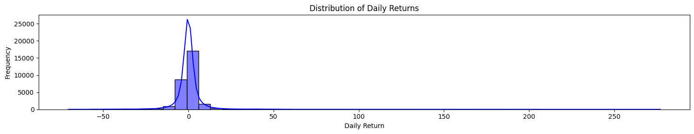
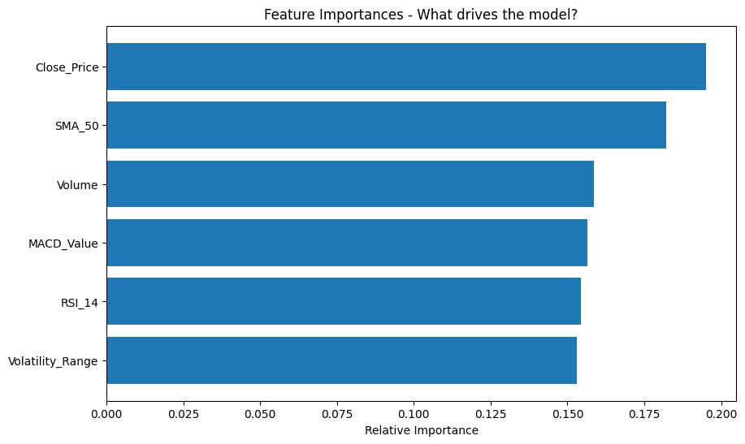
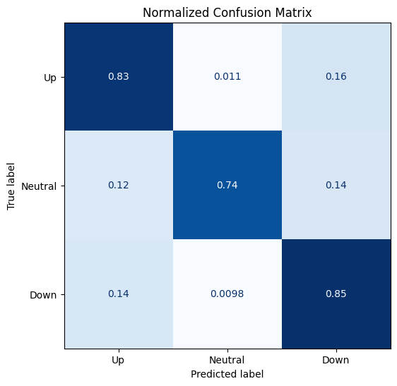
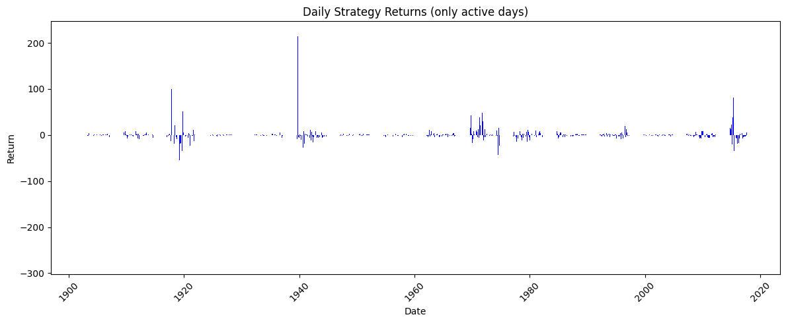

# Market Trend Analysis  
Predictive Modeling and Quantitative Exploratory Data Analysis

## Project Overview

This project presents an end-to-end quantitative analysis of historical market data with the objective of identifying statistically meaningful patterns in daily asset price movements and evaluating whether technical indicators can provide a predictive edge in a low-volatility market regime.

The workflow covers the complete data science lifecycle: data validation, exploratory data analysis (EDA), feature engineering, supervised machine learning, and decision-oriented evaluation of model outputs.

The core modeling task is formulated as a three-class classification problem:

- **Up** – meaningful positive daily return  
- **Down** – meaningful negative daily return  
- **Neutral** – price movement within a predefined noise threshold  

---

## Data Source
The dataset used in this analysis was sourced from Kaggle.

**Dataset Name:** Market Trend Analysis Dataset

**Author:** Kundan Sagar Bedmutha

**Source Link:** [Link to Kaggle Dataset](https://www.kaggle.com/datasets/kundanbedmutha/market-trend-analysis-dataset)

**License:** CC BY 4.0 - [Link to License](https://creativecommons.org/licenses/by/4.0/)

The dataset consists of historical OHLC price data enriched with derived technical indicators.

---

## Methodology

### 1. Data Integrity and Preprocessing

Financial time-series data is particularly susceptible to look-ahead bias, data leakage, and logical inconsistencies. To ensure a robust analytical foundation, the following steps were applied:

- Forward-filling missing values to preserve temporal continuity without introducing future information  
- Logical validation of OHLC prices (e.g. enforcing `High ≥ Low`)  
- Strict chronological sorting of observations  
- Time-aware data splitting to respect temporal dependencies  
- Feature engineering of commonly used technical indicators:
  - Relative Strength Index (RSI)
  - Moving Average Convergence Divergence (MACD)
  - Simple Moving Average (SMA)

---

### 2. Quantitative Exploratory Data Analysis

The EDA phase focused on understanding the statistical properties of daily returns and relationships between engineered features.

#### Distribution of Daily Returns



The distribution of daily percentage returns exhibits a leptokurtic shape with strong concentration around zero, which is characteristic of low-volatility market regimes. This observation motivated the use of a three-class labeling strategy to explicitly separate noise from actionable price movements.

---

### 3. Feature Relationships and Selection

Correlation analysis revealed strong multicollinearity between several momentum-based indicators. These findings guided feature selection decisions to reduce redundancy and improve model stability.

#### Feature Importance (Random Forest)



Price-level features dominate predictive power, while momentum indicators such as RSI and MACD provide complementary secondary signals. No single indicator is sufficient on its own, reinforcing the necessity of multivariate modeling.

---

### 4. Machine Learning Framework

**Problem Type**: Multiclass classification (Up / Neutral / Down)  

**Target Labeling**: Daily returns were discretized using a ±0.5% threshold to distinguish meaningful price movements from market noise.

**Data Split**:
  - 70% training  
  - 15% validation  
  - 15% test  
  (chronological, time-series aware split)

**Models Evaluated**:
  - Logistic Regression  
  - Random Forest  
  - XGBoost  

The Random Forest model demonstrated the most favorable bias–variance trade-off and was selected as the final model.

---

## Results

- **Final Test Accuracy**: approximately 0.41  
- **Three-Class Random Baseline**: approximately 0.33  
- **Predictive Edge**: ~8 percentage points above random guessing  

The minimal gap between validation and test accuracy indicates stable generalization. Results are interpreted conservatively, acknowledging the inherent difficulty of financial prediction in low-volatility environments.

---

## Model Evaluation

### Confusion Matrix



The normalized confusion matrix provides a detailed view of class-level performance. The model shows its strongest performance in identifying neutral market conditions, which dominate in low-volatility regimes. Misclassifications primarily occur between upward and downward movements near the labeling threshold, reflecting the intrinsic ambiguity of marginal price changes.

---

### Active Strategy Daily Returns



This visualization presents daily returns for periods in which the model generated an active trading signal (long or short). It highlights when the model chose to engage with the market and the corresponding distribution of gains and losses on those days.

---

## Tools and Technologies

- **Programming Language**: Python  
- **Data Analysis**: Pandas, NumPy  
- **Machine Learning**: Scikit-learn, XGBoost  
- **Visualization**: Matplotlib, Seaborn, Plotly  
- **Environment**: Google Colab  

---

## Key Takeaways

- Even in highly stable, low-volatility markets, technical indicators can provide a measurable predictive signal  
- Accuracy alone is insufficient for evaluating financial models; class-level analysis is critical in imbalanced, noise-dominated datasets  
- Conservative models that trade infrequently can still extract value by avoiding market noise  
- Proper handling of time-series data is essential to avoid misleading conclusions

---

## Repository Structure
```
data/
├── raw_data.csv
└── cleaned_data.csv

notebooks/
├── 01_Data_Cleaning_and_EDA.ipynb
└── 02_Modeling_and_Prediction.ipynb

reports/
├── feature_importance.png
├── returns_distribution.png
├── confusion_matrix.png
└── strategy_active_days.png
```
